<p align="center"><ins>Install and configure iterm :-</ins></p>

`brew install --cask iterm2 font-fira-code-nerd-font` (required font by starship)

<details><summary>configure iterm global options for non-admin user</summary>

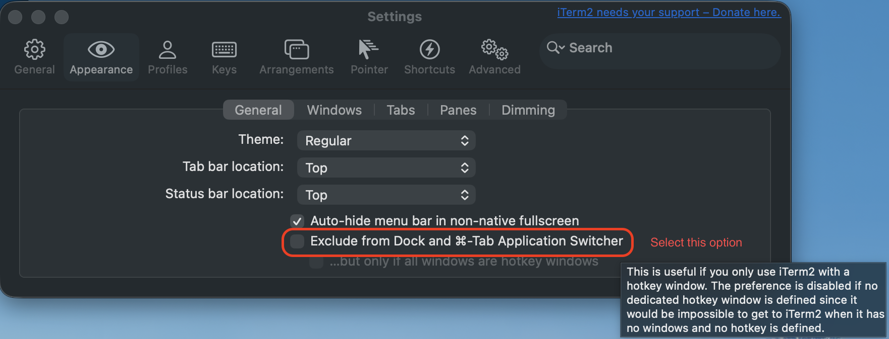

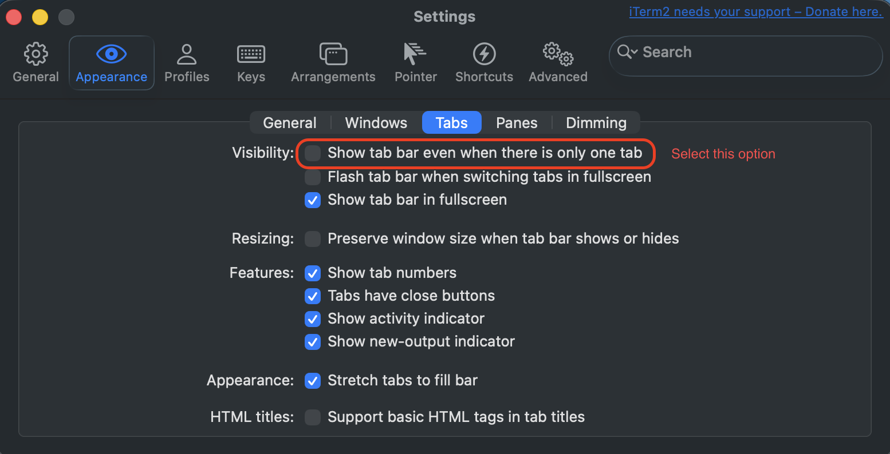

</details>

---

<details><summary>configure iterm new profile options for non-admin user</summary>

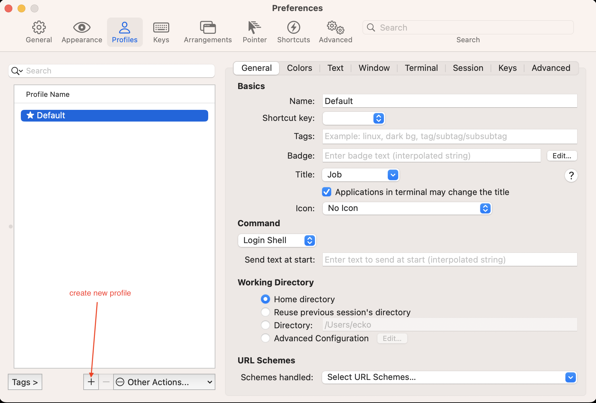


### just provided name visor when profile created

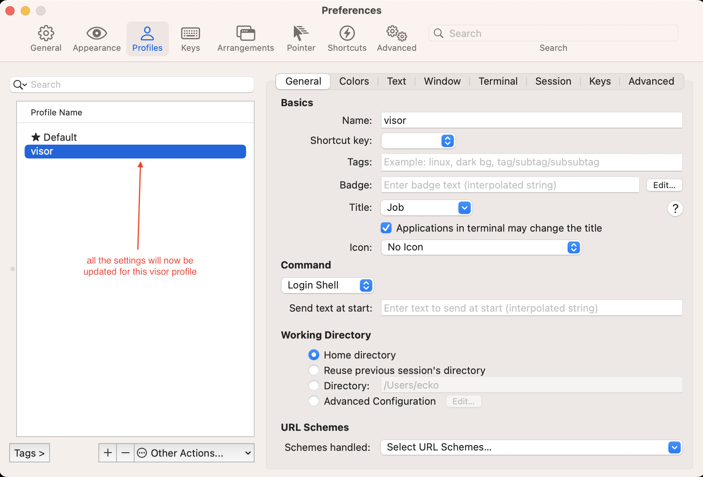

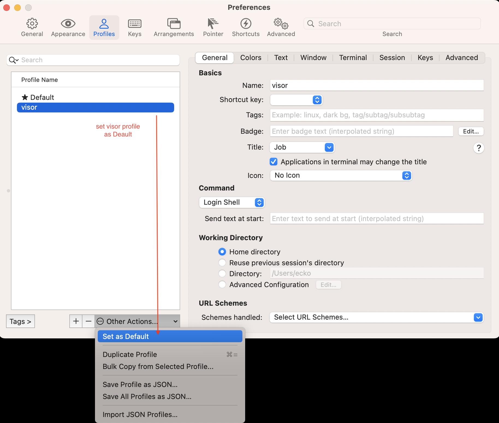

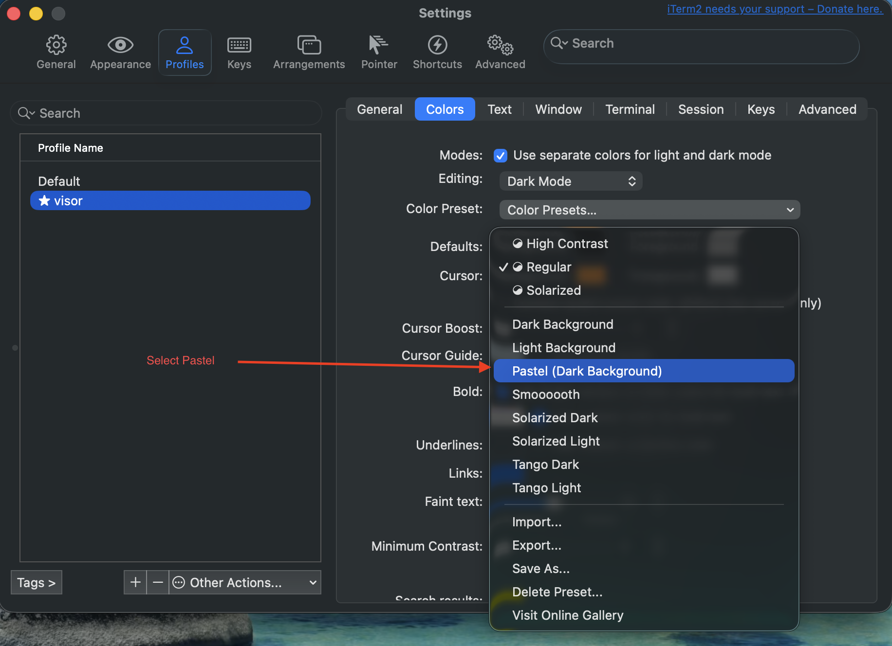

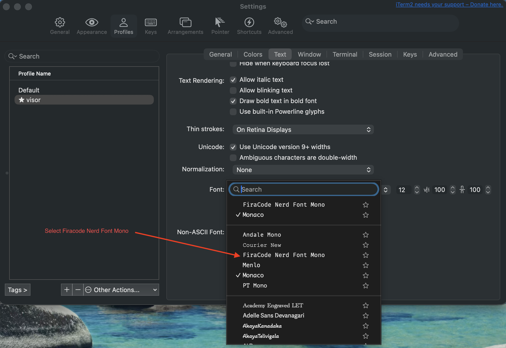

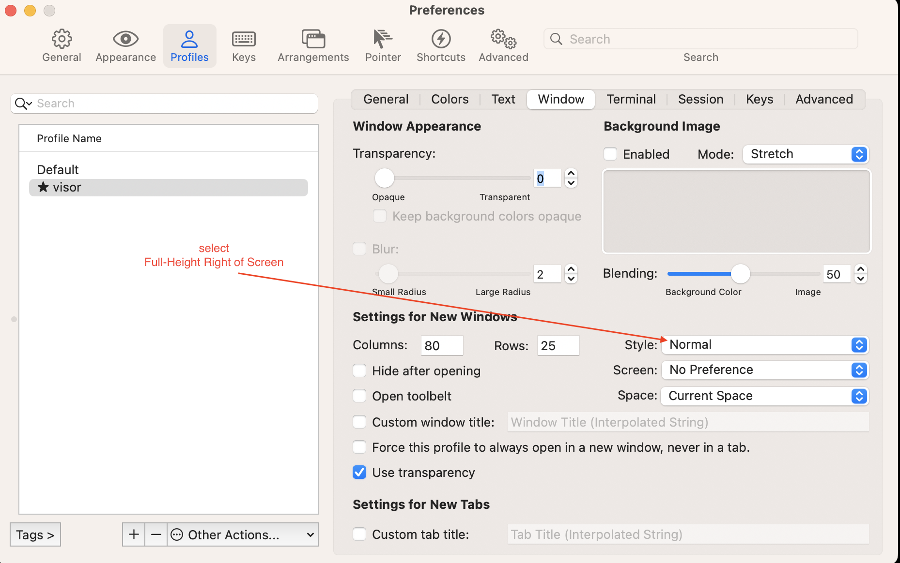

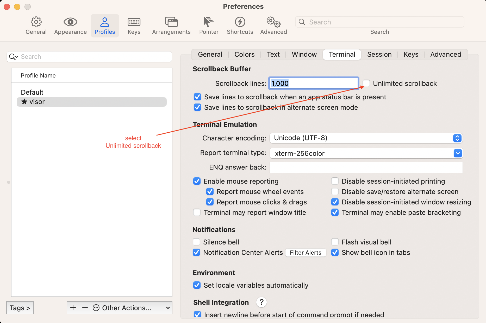

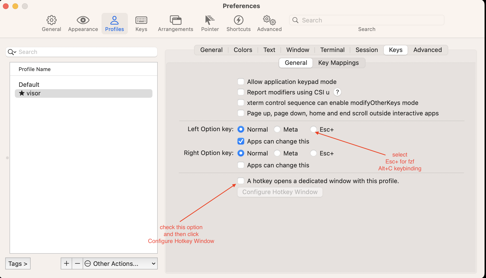

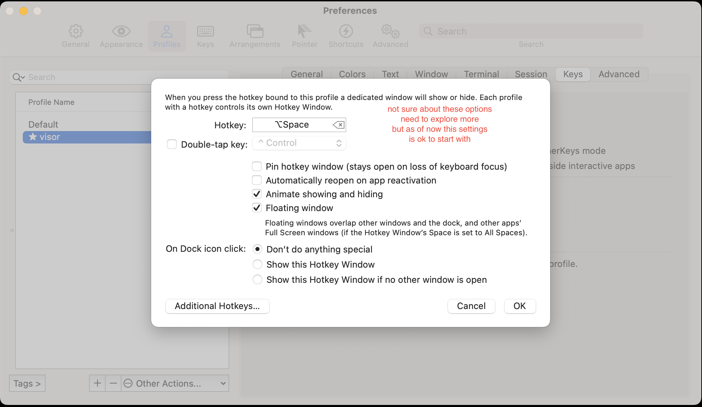


</details>

---

<p align="center"><ins>git log on same screen (git shipped with commandline tools) :-</ins></p>

`git config --global --replace-all core.pager "less -F -X"`


<p align="center"><ins>Configure starship :-</ins></p>

`brew install starship`

Create `.config/starship.toml`

```
format = """
$directory $git_branch$git_status$all
$character"""

[line_break]
disabled = false

[directory]
truncation_length = 0
truncate_to_repo = false
```

---

<p align="center"><ins>Configure Zsh plugins :-</ins></p>

`brew install antidote`

Create:

`~/.zsh_plugins.txt`

Contents:

```
zsh-users/zsh-autosuggestions
zsh-users/zsh-syntax-highlighting
```

---

<p align="center"><ins>configuration .zshrc :-</ins></p>

```
# ============================================================
# 1. System Configurations
# ============================================================

# Prevents file-descriptor leaks and "too many open files" glitches
ulimit -n 4096


# ============================================================
# 2. Antidote Package Manager
# ============================================================

source $(brew --prefix)/opt/antidote/share/antidote/antidote.zsh

# Loads ONLY your clean syntax highlighter and gray text autosuggestions
antidote load < ~/.zsh_plugins.txt


# ============================================================
# 3. Starship Prompt Engine
# ============================================================

# Initializes your multi-line prompt layout
eval "$(starship init zsh)"

# Silences direnv background text output to protect prompt layouts
export DIRENV_LOG_FORMAT=""

# Allows changing directory by typing the folder name directly
setopt AUTO_CD

# Forces a clean newline immediately after you enter a directory,
# pushing the file list down and away from your typed command.
chpwd() {
  ls -C
}


# ============================================================
# 4. fzf (fuzzy finder)
# ============================================================

# fzf's installer wrote ~/.fzf.zsh but — with "update shell config files: no"
# (see below) — didn't add this line, so source it here for keybindings + completion.
[ -f ~/.fzf.zsh ] && source ~/.fzf.zsh


# ============================================================
# 5. SDKMAN (sdk — JVM/Java version management)
# ============================================================

# Prefer an official ~/.sdkman install; otherwise use brew's sdkman-cli.
[ -d ~/.sdkman ] && export SDKMAN_DIR="$HOME/.sdkman"
[ -d ~/.sdkman ] || export SDKMAN_DIR="$(brew --prefix sdkman-cli)/libexec"
[[ -s "$SDKMAN_DIR/bin/sdkman-init.sh" ]] && source "$SDKMAN_DIR/bin/sdkman-init.sh"
```

open new session to auto install plugins

---

<p align="center"><ins>Configure fzf :-</ins></p>

`brew install fzf`

`$(brew --prefix)/opt/fzf/install`

Recommended answers

When prompted:

Prompt	Answer
fuzzy auto-completion	yes   
key bindings	yes   
update shell config files	no

---

## now refer [softwares.md](https://github.com/teeckoo/mac-setup/blob/main/softwares.md)
