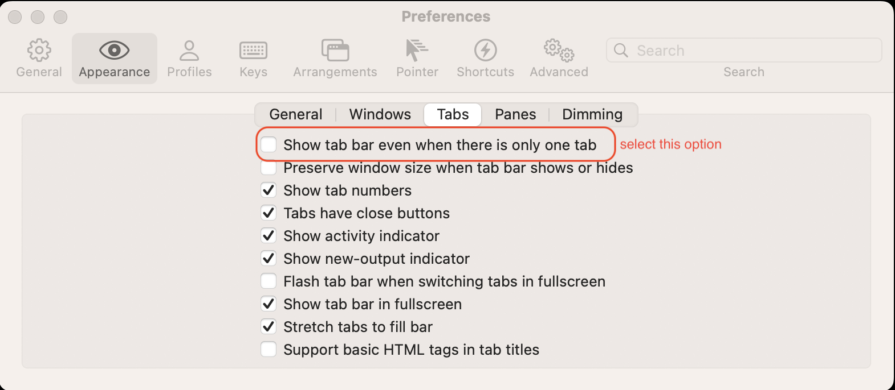
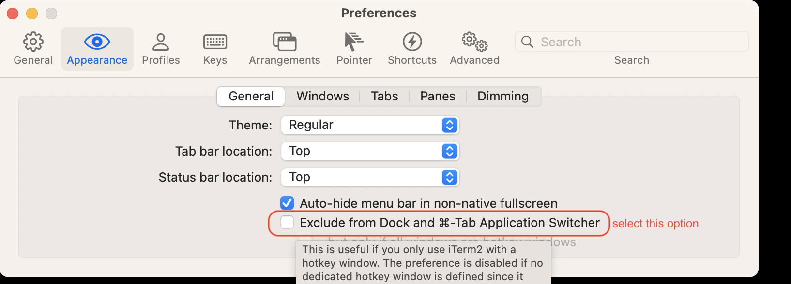
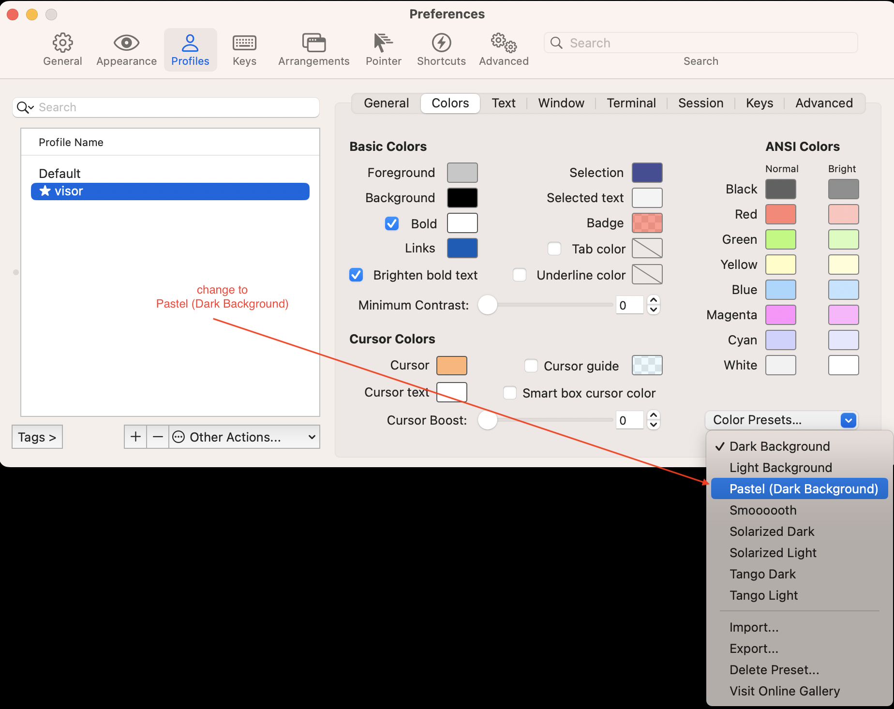
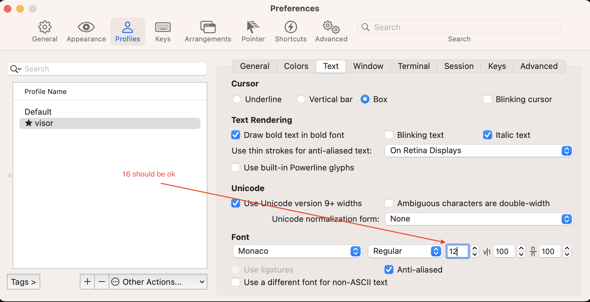

<ins>Install and configure iterm :-</ins>

`brew install --cask iterm2` (if not already installed)

<details><summary>configure iterm global options for non-admin user</summary>





</details>

---

<details><summary>configure iterm new profile options for non-admin user</summary>


### just provided name visor when profile created







</details>

---

<ins>git log on same screen (git shipped with commandline tools) :-</ins>

`git config --global --replace-all core.pager "less -F -X"`


<ins>Configure Zsh plugins :-</ins>

`brew install --cask font-fira-code-nerd-font` (required font by starship, if not already installed)

`brew starship antidote` (if not already installed)

Create `.config/starship.toml`

```
format = """
$directory $git_branch$git_status$all
$character"""

[line_break]
disabled = false

[directory]
truncation_length = 0
truncate_to_repo = false
```


Create:

`~/.zsh_plugins.txt`

Contents:

```
zsh-users/zsh-autosuggestions
zsh-users/zsh-syntax-highlighting
```

---

<ins>add below configuration to .zshrc :-</ins>

```
# ============================================================
# 1. System Configurations
# ============================================================

# Prevents file-descriptor leaks and "too many open files" glitches
ulimit -n 4096


# ============================================================
# 2. Antidote Package Manager
# ============================================================

source $(brew --prefix)/opt/antidote/share/antidote/antidote.zsh

# Loads ONLY your clean syntax highlighter and gray text autosuggestions
antidote load < ~/.zsh_plugins.txt


# ============================================================
# 3. Starship Prompt Engine
# ============================================================

# Initializes your multi-line prompt layout
eval "$(starship init zsh)"

# Silences direnv background text output to protect prompt layouts
export DIRENV_LOG_FORMAT=""

# Allows changing directory by typing the folder name directly
setopt AUTO_CD

# Forces a clean newline immediately after you enter a directory,
# pushing the file list down and away from your typed command.
chpwd() {
  ls -C
}
```

open new session to auto install plugins

---

<ins>Configure fzf (one time activity) :-</ins>

`$(brew --prefix)/opt/fzf/install`

Recommended answers

When prompted:

Prompt	Answer
fuzzy auto-completion	yes   
key bindings	yes   
update shell config files	no

---

now refer `softwares.md`
